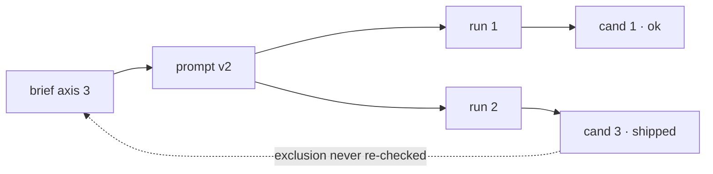

<!-- design:deferred -->
Purpose: the copy-paste form for each trigger, so a diagram costs a minute rather than a decision.
Read when: a finding has hit one of the triggers and the shape is not obvious.
Source: none — nothing outside this page can move what it states.
Verified: 2026-08-23 — no automated check reads the drawings. What is checked is
that this page and `visualise` between them define every trigger, form and floor
word the registry declares; a rule in `design-tools/validate.py` re-runs that on
every commit, so a word deleted from here fails the build.

# Forms

Four shapes cover almost everything. Pick by trigger, not by taste.

## `location` — the region map

The default here. Divide the screen the way the layout divides it, mark each
finding where it is, number the marks, and let the findings refer to the numbers.

```
card, 320 x 200, viewed at 1x

┌──────────────────────────────────┐
│  ① title                         │
│                                  │
│  body text                       │
│                       ② price    │
├──────────────────────────────────┤
│  ③ [ buy ]                       │
└──────────────────────────────────┘

① major     title and body are one step apart on the scale; no hierarchy
② major     price sits below the fold at the 360px breakpoint
③ blocking  target is 32px tall against a 44px floor
```

Say the component, its size, and the density you judged at, or the marks mean
nothing.

## `disagreement` — two columns

The intended order against the order the render produces. Also a token against
the value actually used, or a state against its specification.

```
                    intended        as rendered
first               price           title       ← disagree
second              title           buy
third               buy             price
```

## `hops` — the token chain

When a value's problem is where it came from rather than what it is.

```
--brand-600 ──▶ --surface-accent ──▶ .badge background
                       │
                       └─ 3.1:1 against --text-on-accent; 4.5:1 required
```

## `ordering` — two lanes

For motion and state-change findings: what moves when, and the overlap that
reads wrong.

```
panel   ────────[ slide in 300ms ]────────
scrim   ──[ fade 120ms ]──
                          ▲ 180ms of panel over an already-opaque scrim
```

## Mermaid, when it is a graph

More than about six nodes, or branching and merging that ASCII would misalign.
It needs a renderer, so it is a trade.

````

````

Keep node labels to what was opened. A mermaid graph is as easy to fill with
untraced edges as a sentence is, and harder to argue with, which is the danger.

## Drawing them

- Box characters `┌ ┐ └ ┘ ├ ┤ ┬ ┴ ┼ │ ─`, arrows `──▶ ▲ ▼ └─`
- Keep the whole thing under about 70 columns so nothing wraps in a terminal
- Circled numbers `① ② ③` for marks; they survive being pasted anywhere
- Align by spaces, never tabs
- A legend under the drawing, not inside it

## What none of these do

They do not carry evidence. A map shows where a finding is, not that anyone
looked — the grade beside the finding says that, and a beautifully drawn
`asserted` is still `asserted`.
