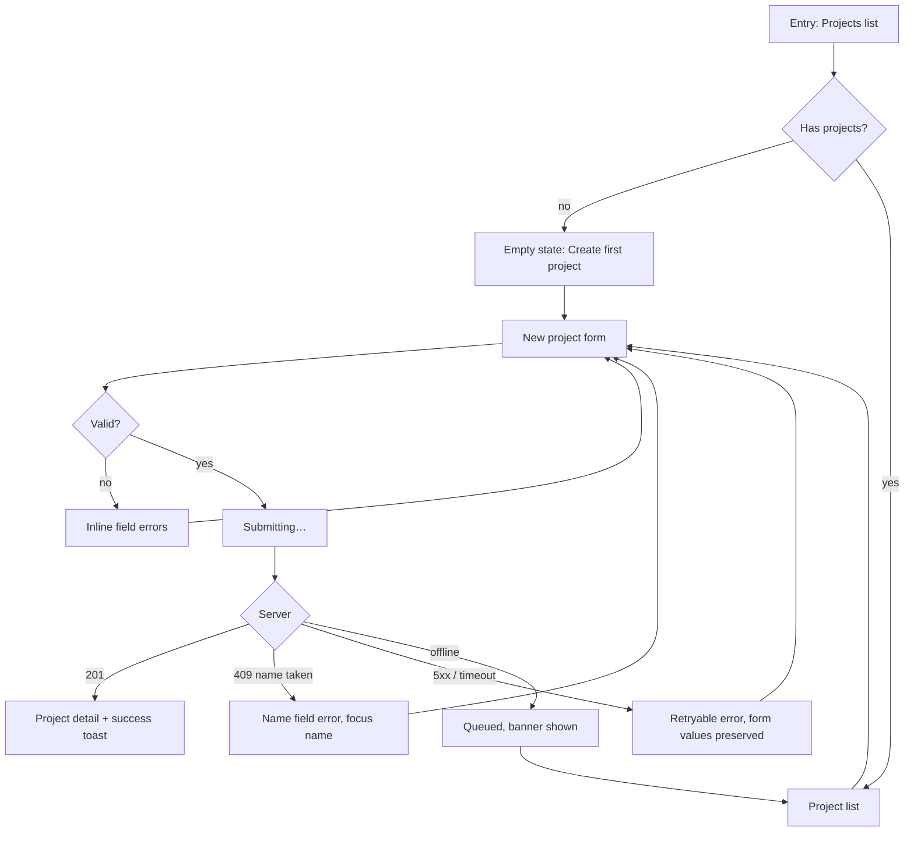

<!-- design:guidance -->
# Flows

A flow is the path a user takes to finish a job. Design it before any screen.

## What a flow must contain

| Element | Question it answers |
|---------|--------------------|
| Entry points | How does the user arrive? All of them — nav, deep link, notification, empty state, search |
| Steps | What is the minimum sequence? |
| Branches | Where does the path fork, and on what? |
| Failure paths | What happens when each step fails? |
| Exits | Success exit, cancel exit, abandon-and-return |
| Re-entry | What happens if they come back mid-flow? |

A flow with no failure branches is not finished. Most real UX debt lives there.

## Diagram

Rules:
- Every `-->` out of a network call has at least three targets: success, expected failure, unexpected failure.
- Preserve user input across every failure branch. Losing a filled form is the most costly avoidable failure in UX.
- Mark where focus lands on each branch.

## Flow quality checks

| Check | Fail signal |
|-------|-------------|
| Step count | More steps than the job needs; each step must earn its place |
| Reversibility | A step cannot be undone or backed out of |
| Input preservation | Any branch that discards entered data |
| Dead ends | A state with no forward action and no way back |
| Re-entry | Returning mid-flow starts over |
| Deep link | The flow only works from one entry point |
| Interruption | A phone call, tab switch, or refresh loses progress |

## Reducing steps

In priority order:

1. **Remove** — is this step required, or is it required *by us*? Ask what breaks if it is dropped.
2. **Default** — can it be answered correctly for most users without asking?
3. **Infer** — can it be derived from data already held (locale, plan, prior choice)?
4. **Defer** — must it be answered now, or can it wait until it matters?
5. **Merge** — can two steps live on one screen without crowding?
6. **Parallelise** — can the user proceed while a slow step completes in the background?

Only after all five does splitting into more, simpler steps become the right answer.

## Multi-step flows

- Show progress: step N of M, with M known. An unknown M reads as endless.
- Allow backward movement without data loss.
- Validate per step, not only at the end.
- Save progress. A wizard that loses everything on refresh is a wizard nobody finishes.
- Put the shortest, easiest step first — momentum is real.
- Put the highest-abandonment step (payment, permissions) as late as the job allows.

## Interruption and resumption

Specify explicitly for any flow longer than one screen:

| Event | Behaviour |
|-------|-----------|
| Refresh | Resume at current step with values intact |
| Back button | Previous step, not exit |
| Close / navigate away | Warn only if unsaved work exists; otherwise let them go |
| Return later | Resume, or a clear "start over" with what was kept |
| Session expiry | Preserve input, re-authenticate, return to the same step |

## Anti-patterns

- A confirmation screen that confirms nothing the user did not just see.
- "Are you sure?" on a reversible action.
- A success screen that offers no next action.
- A flow whose only exit is completing it.
- Validation that only runs on the final submit of a 6-step wizard.
- A modal opened from a modal.
